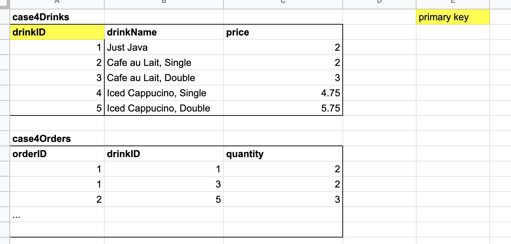

# NTU EE4717 - Web Application Design
* Group F31-DG13

## Case studies
* Case Study 1: inside `/exercises/Week 2`
* Case Study 2: inside `/exercises/Week 4`
* Case Study 3 & 4: inside `/exercises`

## Notes for Case Study 4:
* There are 2 tables in the database as seen below:

* In order to generate this table please import the `create_tables.sql` and `insert_into_tables.sql` ONCE into your myPHPadmin page.

## Projects
* You can start writing HTML/CSS/JS/PHP files inside the `project` folder for our project. But just lemme create one page for CSS styling format first.
